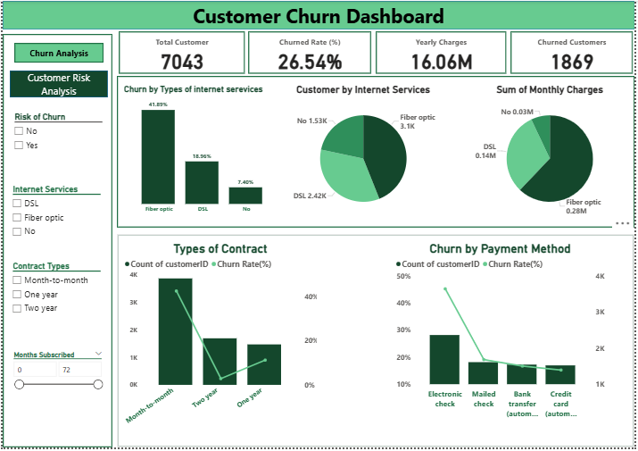

{
 "cells": [
  {
   "cell_type": "markdown",
   "id": "1888b967-ba6a-495d-be41-7c4ac2d7ec48",
   "metadata": {},
   "source": [
    "# **Customer Churn Analysis**\n",
    "Analyzing telecom customer churn using customer data to identify key churn drivers and deliver insights through Python and Power BI.\n"
   ]
  },
  {
   "cell_type": "markdown",
   "id": "ade17afa-fa6b-4395-af62-6c0c4250aa49",
   "metadata": {},
   "source": [
    "##  Table of Contents\n",
    "- <a href=\"#overview\">Overview</a>\n",
    "- <a href=\"#business-problem\">Business Problem</a>\n",
    "- <a href=\"#dataset\">Dataset</a>\n",
    "- <a href=\"#tools--technologies\">Tools & Technologies</a>\n",
    "- <a href=\"#data-cleaning--preparation\">Data Cleaning & Preparation</a>\n",
    "- <a href=\"#exploratory-data-analysis-eda\">Exploratory Data Analysis (EDA)</a>\n",
    "- <a href=\"#dashboard\">Dashboard</a>\n",
    "- <a href=\"#final-recommendations\">Final Recommendations</a>\n",
    "- <a href=\"#author--contact\">Author & Contact</a>\n"
   ]
  },
  {
   "cell_type": "markdown",
   "id": "e936f635-5aa9-4ebd-9313-bd956509dbfe",
   "metadata": {},
   "source": [
    "<h2>Overview</h2>\n",
    "This project focuses on analyzing customer churn in a telecommunications company. The dataset was cleaned and preprocessed using Excel and Python, followed by exploratory data analysis (EDA) to identify factors influencing customer churn. Insights were visualized using an interactive Power BI dashboard.\n",
    "\n"
   ]
  },
  {
   "cell_type": "markdown",
   "id": "53265565-edd2-42a1-a949-6e08524c787e",
   "metadata": {},
   "source": [
    "## Business Problem\n",
    "Customer churn directly impacts revenue and growth in the telecom industry.  \n",
    "This project aims to:\n",
    "- Calculate the overall customer churn rate\n",
    "- Identify customer segments with higher churn risk\n",
    "- Analyze the impact of contract type, tenure, payment method, and charges on churn\n",
    "- Support data-driven customer retention strategies"
   ]
  },
  {
   "cell_type": "markdown",
   "id": "f4b01250-155d-4523-95a1-44c7ed6655b4",
   "metadata": {},
   "source": [
    "## Dataset\n",
    "- Dataset File: [Clean_Telco_Customer_Churn_Dataset.csv](Clean%20Telco%20Customer%20Churn%20Dataset.csv)\n",
    "- Telecom customer churn dataset\n",
    "- Cleaned using Excel and Python\n",
    "- Missing values handled, data types corrected, and features prepared for analysis"
   ]
  },
  {
   "cell_type": "markdown",
   "id": "b5980ff5-29be-4352-a1af-b6ca9c4750fd",
   "metadata": {},
   "source": [
    "## Tools & Technologies\n",
    "- **Python**: Pandas, NumPy, Matplotlib, Seaborn\n",
    "- **Excel**: Data Cleaning & Preprocessing\n",
    "- **Power BI**: Interactive Dashboard & Visualizations\n",
    "- **GitHub**: Project version control and documentation"
   ]
  },
  {
   "cell_type": "markdown",
   "id": "5d2ffcc6-e372-4440-964e-a96a39c55c3f",
   "metadata": {},
   "source": [
    "## Data Cleaning & Preparation\n",
    "- Handled missing and null values in numerical columns\n",
    "- Corrected data types for analysis and visualization\n",
    "- Created derived features for better churn analysis\n",
    "- Prepared a clean dataset for Python EDA and Power BI"
   ]
  },
  {
   "cell_type": "markdown",
   "id": "5b43e50b-bfe8-40d6-9733-49fd6ea96e18",
   "metadata": {},
   "source": [
    "##  Exploratory Data Analysis (EDA)\n",
    "Key analyses performed using Python:\n",
    "- Overall churn rate calculation\n",
    "- Churn analysis by:\n",
    "  - Contract type\n",
    "  - Tenure\n",
    "  - Payment method\n",
    "- Relationship between monthly charges, total charges, and churn\n",
    "- Identification of high-risk customer segments\n"
   ]
  },
  {
   "cell_type": "markdown",
   "id": "71555eba-eed4-4142-bbde-3690811eebb5",
   "metadata": {},
   "source": [
    "## Dashboard\n",
    "An interactive Power BI dashboard was created to visualize:\n",
    "- Overall churn rate\n",
    "- Churn distribution across customer segments\n",
    "- Charges vs churn trends\n",
    "- High-risk customer groups\n",
    "\n",
    "\n"
   ]
  },
  {
   "cell_type": "markdown",
   "id": "c8308b37-8a52-4ce9-af22-6eb233027bbd",
   "metadata": {},
   "source": [
    "## Final-Recommendations\n",
    "- Promote long-term contracts to reduce churn\n",
    "- Offer retention plans for new and low-tenure customers\n",
    "- Improve payment methods to lower churn risk\n",
    "- Target high monthly charge customers with personalized offers"
   ]
  },
  {
   "cell_type": "markdown",
   "id": "a2f318d2-b403-407c-b2c3-e08283f0c21f",
   "metadata": {},
   "source": [
    "## Author-Contact\n",
    "\n",
    "**Hemangi Parab**  \n",
    "Data Analyst  \n",
    "Email: hemangiparab05@gmail.com\n"
   ]
  },
  {
   "cell_type": "code",
   "execution_count": null,
   "id": "c7a72dcf-4124-4969-8b86-7064f85e2e8b",
   "metadata": {},
   "outputs": [],
   "source": []
  }
 ],
 "metadata": {
  "kernelspec": {
   "display_name": "Python [conda env:base] *",
   "language": "python",
   "name": "conda-base-py"
  },
  "language_info": {
   "codemirror_mode": {
    "name": "ipython",
    "version": 3
   },
   "file_extension": ".py",
   "mimetype": "text/x-python",
   "name": "python",
   "nbconvert_exporter": "python",
   "pygments_lexer": "ipython3",
   "version": "3.13.9"
  }
 },
 "nbformat": 4,
 "nbformat_minor": 5
}
